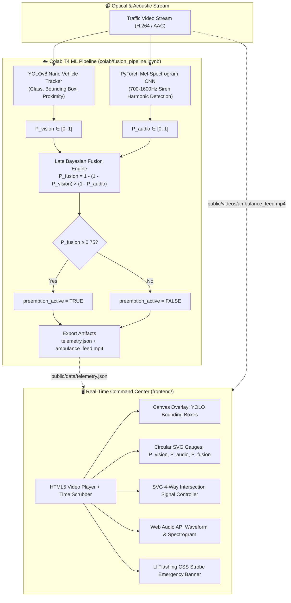

# 🚨 Audio-Visual Sensor Fusion for Emergency Vehicle Preemption

[](https://vitejs.dev/)
[](https://github.com/ultralytics/ultralytics)
[](https://pytorch.org/)
[](LICENSE)

An end-to-end Intelligent Transportation Systems (ITS) command center that fuses **YOLOv8 computer vision object tracking** with **PyTorch Mel-Spectrogram acoustic siren detection** using **Late Bayesian Sensor Fusion**. The system dynamically overrides traffic signals to establish an autonomous **Emergency Green Corridor** when confidence exceeds the $0.75$ safety threshold.

---

## 🏛️ System Architecture



---

## 📐 Mathematical Formulation: Late Bayesian Fusion

Single-modality emergency preemption creates severe failure risks in real-world urban canyons:
* **Visual Occlusion:** Large trucks or double-decker buses block optical sightlines.
* **Acoustic Noise:** Heavy rain, echoing glass towers, or ambient construction mask sirens.

To solve this, we compute the combined probability of an active emergency event using **Late Bayesian Fusion**:

$$P_{fusion} = 1 - (1 - P_{vision}) \times (1 - P_{audio})$$

Where:
* $P_{vision} \in [0, 1]$: Confidence of emergency vehicle detection via YOLOv8.
* $P_{audio} \in [0, 1]$: Confidence of emergency siren acoustics via Mel-Spectrogram CNN.
* $P_{fusion} \in [0, 1]$: Dual-modality fused confidence.

**Preemption Trigger:**
$$\text{Signal State} = \begin{cases} 
\text{EMERGENCY GREEN CORRIDOR (Locked Green, Cross-lanes Red)}, & \text{if } P_{fusion} \ge 0.75 \\
\text{NORMAL CYCLIC OPERATION}, & \text{otherwise}
\end{cases}$$

---

## 📁 Repository Structure

```text
its-emergency-detection/
├── colab/
│   └── fusion_pipeline.ipynb            # Self-contained Colab T4 GPU ML pipeline
├── frontend/
│   ├── index.html                       # Split-screen Command Center layout
│   ├── package.json                     # Vite configuration & scripts
│   ├── vite.config.js
│   ├── public/
│   │   ├── data/
│   │   │   └── telemetry.json           # Synchronized frame-by-frame ML telemetry
│   │   └── videos/
│   │       └── ambulance_feed.mp4       # Web-compatible H.264 video with siren audio
│   └── src/
│       ├── main.js                      # Core synchronization engine (Video <-> UI)
│       ├── gauges.js                    # SVG circular telemetry gauges
│       ├── trafficLight.js              # SVG 4-way adaptive intersection controller
│       ├── visualizer.js                # Web Audio API waveform & spectrogram
│       ├── detectionOverlay.js          # YOLO bounding box canvas tracker
│       ├── preemptionManager.js         # Strobe alert banner & alarm dispatcher
│       └── style.css                    # Obsidian dark-mode tactical styling
├── LICENSE                              # MIT License
└── README.md
```

---

## 🚀 Step-by-Step Google Colab Workflow

Follow these instructions to run the machine learning pipeline on Google Colab:

### 1. Upload to Google Colab
1. Navigate to [Google Colab](https://colab.research.google.com/).
2. Click **File** &rarr; **Upload notebook**.
3. Select the file [`colab/fusion_pipeline.ipynb`](colab/fusion_pipeline.ipynb) from this repository.
4. Ensure hardware acceleration is set to GPU:
   * Go to **Runtime** &rarr; **Change runtime type** &rarr; Select **T4 GPU** &rarr; Click **Save**.

### 2. Execute the Pipeline
Run all cells sequentially (**Runtime** &rarr; **Run all** or `Ctrl + F9`):
1. **Cell 1 (Dependencies):** Installs `ultralytics`, `torchaudio`, `librosa`, `yt-dlp`, and `soundfile`.
2. **Cell 2 (Ingestion):** Downloads traffic video via `yt-dlp` or generates a high-fidelity synthetic benchmark clip.
3. **Cell 3 (Vision):** Loads `yolov8n.pt` and extracts vehicle bounding boxes and optical scores.
4. **Cell 4 (Audio):** Computes Mel-Spectrograms and analyzes 700Hz - 1600Hz acoustic siren energy bands.
5. **Cell 5 (Fusion):** Computes $P_{fusion} = 1 - (1 - P_{vision})(1 - P_{audio})$ frame-by-frame and checks threshold $\ge 0.75$.
6. **Cell 6 (Export):** Packages all inferences into `telemetry.json` and triggers automatic browser download.

### 3. Save Downloaded Artifacts to Frontend
Once Colab finishes, two files will be saved/downloaded:
1. Move `telemetry.json` &rarr; `frontend/public/data/telemetry.json`
2. Move `ambulance_feed.mp4` &rarr; `frontend/public/videos/ambulance_feed.mp4`

*(Note: High-fidelity sample assets are already pre-generated in `frontend/public/` so you can launch the dashboard immediately without waiting for Colab!)*

---

## 💻 Local Frontend Dashboard Setup

The frontend is powered by Vite and Vanilla JavaScript for maximum performance and instant sub-millisecond timeline synchronization.

### 1. Install Dependencies
```bash
cd frontend
npm install
```

### 2. Start Local Development Server
```bash
npm run dev
```
Open your browser at `http://localhost:5173`.

### 3. Build for Production
```bash
npm run build
npm run preview
```

---

## 🎮 Interactive Features & Hotkeys

* **Spacebar or Play Button:** Toggle video playback.
* **Timeline Slider:** Scrub through the 30-second timeline. Watch the bounding boxes, circular confidence gauges, and 4-way traffic signals update instantly with zero lag.
* **⚡ JUMP TO EVENT Button:** Seeks directly to $t = 9.50\text{s}$ where siren confidence spikes and the Emergency Green Corridor triggers.
* **🚨 FORCE PREEMPTION Button:** Manually override the traffic signal controller to test dispatch protocols.
* **🔇 Audio Mute Button:** Toggle siren sound and connect Web Audio API frequency analyzer.

---

## 📄 License
This project is licensed under the MIT License - see the [LICENSE](LICENSE) file for details.
